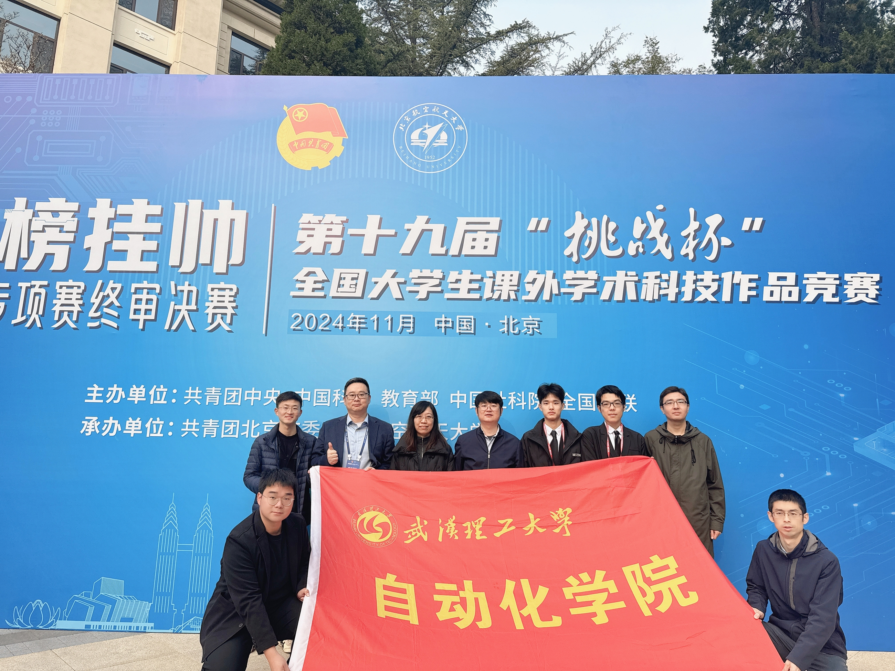
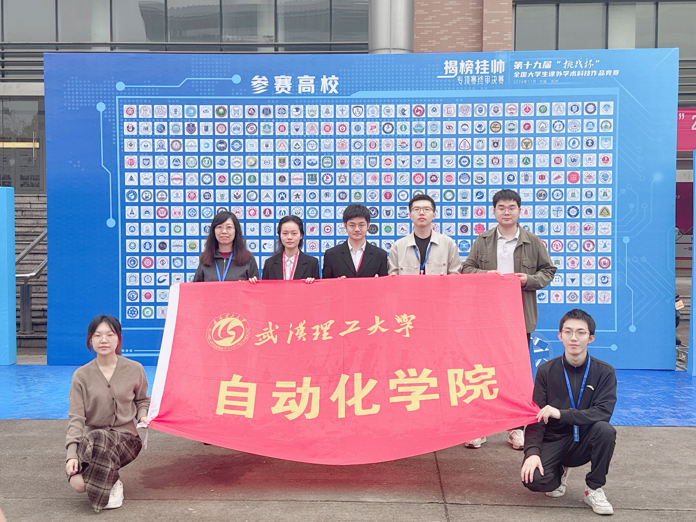

　　11月17日，第十九届“挑战杯”全国大学生课外学术科技作品竞赛2024年度“揭榜挂帅”专项赛终审决赛落下帷幕。学院报送的两个项目分别获得国赛特等奖、二等奖的好成绩，实现了我院在该赛事特等奖零的突破！

　　本次竞赛以“你来挑，我来战”为主题，通过“征榜—发榜—竞榜—评榜—夺榜”，由企事业单位提出需求，组委会面向高校和社会广发“英雄帖”，高校学生团队和青年科技人才团队打擂揭榜。经过文本评审、现场答辩等环节激烈角逐，最终，由田猛、董政呈、张清勇三位老师指导，龙云翀、喻亚洲等成员负责的《电通路明——基于电网-交通网-通信网协同调度灾后城市智能供电恢复系统》项目斩获全国特等奖；由张清勇、徐冰瑢、周权三位老师指导，李嘉琪，戢凯伦等成员负责的《海云智视：FPGA仿真平台下的海洋多目标检测、跟踪与定位综合系统》项目斩获国家二等奖。
<figure style="margin-bottom:10px;">
  
  <figcaption style="text-align:center; font-size:14px; color:gray; margin-top:6px;">
  </figcaption>
</figure>
  
  <figcaption style="text-align:center; font-size:14px; color:gray; margin-top:6px;">
  </figcaption>
</figure>
　　据悉，“挑战杯”全国大学生课外学术科技作品竞赛是由共青团中央、中国科协、教育部、中国社科院、全国学联和承办地省级人民政府共同主办的一项具有导向性、示范性和群众性的竞赛活动，被誉为当代大学生科技创新的“奥林匹克”盛会。本年度“揭榜挂帅”专项赛终审决赛在北京场和浙江场分开举办，设置高校学生赛道和青年科技人才赛道，共吸引2.7万余人参加，共有6500余件参赛作品，最终来自全国410余所高校和企业的1950余件作品入围终审决赛。

　　自今年4月份“揭榜挂帅”专项赛事“发榜”以来，学院高度重视赛事相关工作，积极开展动员宣传，联动校院两级资源深入挖掘作品、支持重点作品，积极征榜。作品培育阶段，学院开展多作品打磨会，不断助力项目迭代升级。比赛当天，学院罗杰副院长带领师生参赛，通过观摩和学习与兄弟院校进行了充分的沟通和交流。

　　此次赛事实现零的突破，是对我院“一心三级”育人体系的充分肯定，同时也是“创新训练营”计划开展以来收获的又一丰硕成果。未来，学院将继续拓展学生科技创新平台，引领青年奋力书写为中国式现代化挺膺担当的青春篇章。

  文：卢陆　图：卢陆 
  审核：吕睿　编辑：李子根

  来源：<a href="原文链接" target="_blank">武汉理工大学自动化学院官网</a>

